# CertiPENS Web Frontend Screenshots

Berikut adalah kumpulan screenshot dari antarmuka pengguna (Frontend) web CertiPENS.

## 1. Landing

### 01 Landing Page Top

Tampilan bagian atas dari halaman utama (landing page) yang berisi hero section dan navigasi utama.

### 02 Landing Page Middle

Tampilan bagian tengah halaman utama yang menjelaskan fitur-fitur atau informasi terkait sertifikasi.

### 02 Landing Page Bottom

Tampilan bagian bawah (footer) dari halaman utama beserta informasi kontak dan tautan terkait.

## 2. Login & Register

### 01 Login

Halaman login untuk pengguna yang sudah memiliki akun.

### 02 Register

Halaman registrasi bagi asesi atau asesor untuk mendaftar akun baru di sistem CertiPENS.

## 3. Admin

### 01 Dashboard
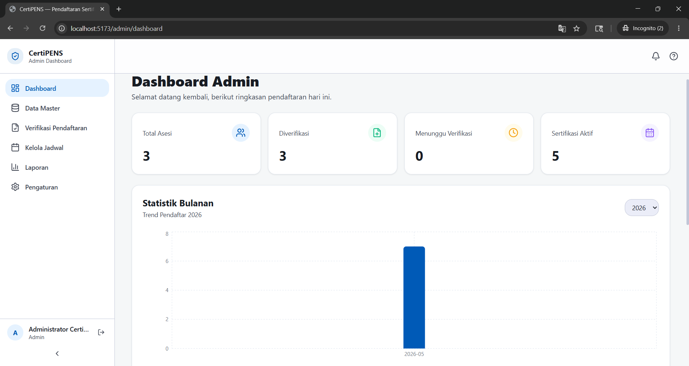
Tampilan utama dashboard admin yang memuat ringkasan statistik dan aktivitas terbaru.

### 02 Dashboard
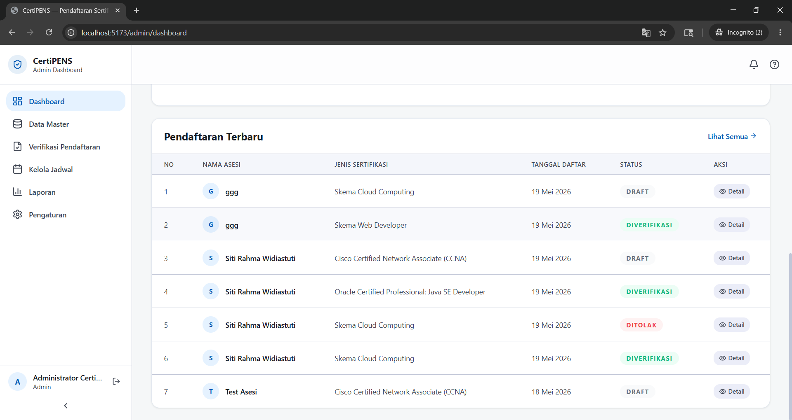
Tampilan lanjutan dari dashboard admin.

### 03 Data Master Sertifikasi

Halaman pengelolaan data master sertifikasi, seperti skema sertifikasi dan unit kompetensi.

### 04 Data Master Kelola Akun

Halaman bagi admin untuk mengelola (CRUD) akun pengguna, baik asesor maupun asesi.

### 05 Verifikasi Pendaftaran

Halaman untuk memeriksa dan memverifikasi pendaftaran sertifikasi dari asesi.

### 06 Kelola Jadwal
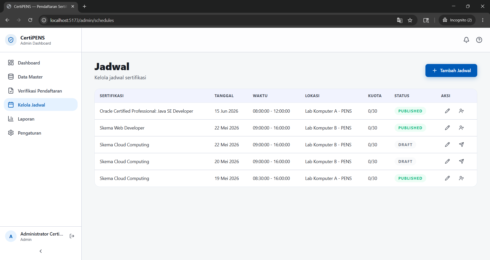
Halaman pengelolaan jadwal sertifikasi dan penugasan asesor.

### 07 Laporan
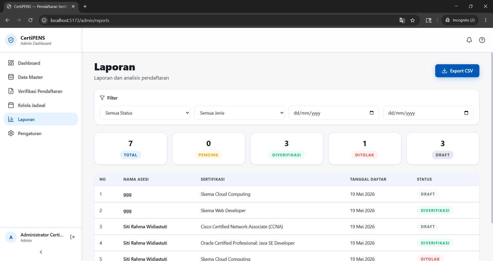
Halaman laporan terkait pelaksanaan sertifikasi dan kelulusan.

### 08 Pengaturan Pengumuman

Halaman untuk membuat dan mengatur pengumuman yang akan ditampilkan di sistem.

### 08 Pengaturan Profile

Halaman pengaturan profil untuk akun admin.

## 4. Asesor

### 01 Dashboard
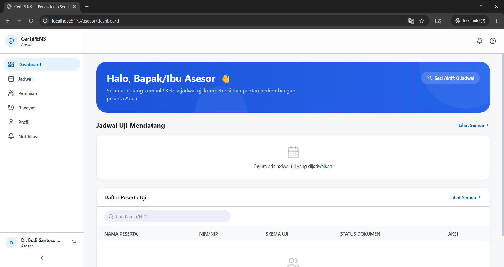
Tampilan dashboard untuk asesor yang berisi ringkasan tugas dan jadwal penilaian.

### 02 Jadwal
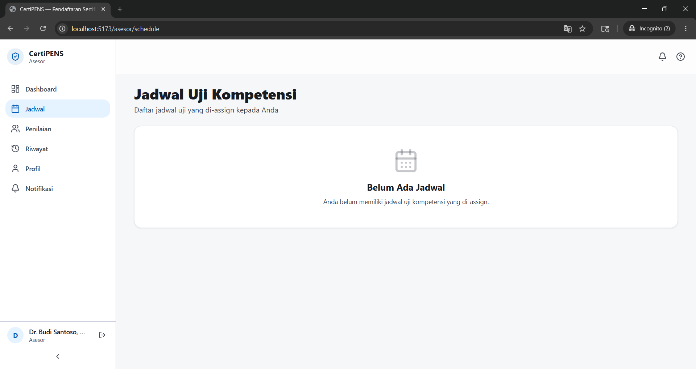
Halaman daftar jadwal sertifikasi yang ditugaskan kepada asesor.

### 03 Penilaian
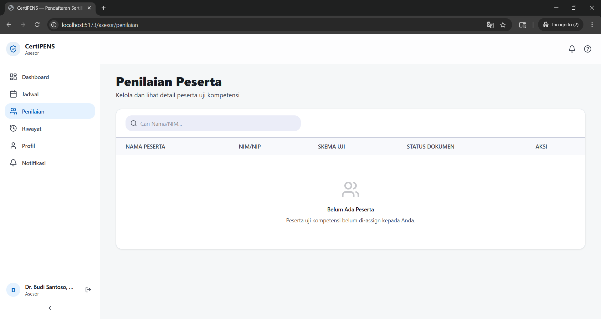
Halaman form pengisian nilai dan asesmen kompetensi untuk asesi.

### 04 Riwayat
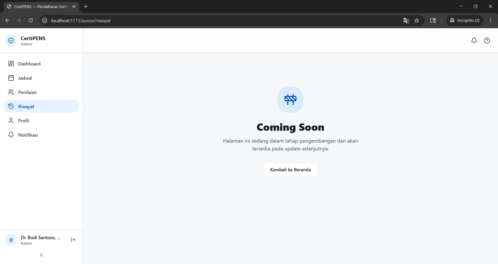
Halaman riwayat asesmen yang telah diselesaikan oleh asesor.

### 05 Profil
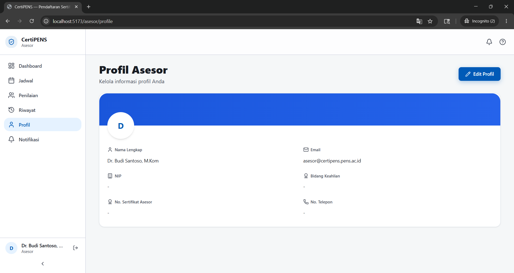
Halaman profil asesor untuk melihat atau mengubah data diri.

### 06 Notifikasi
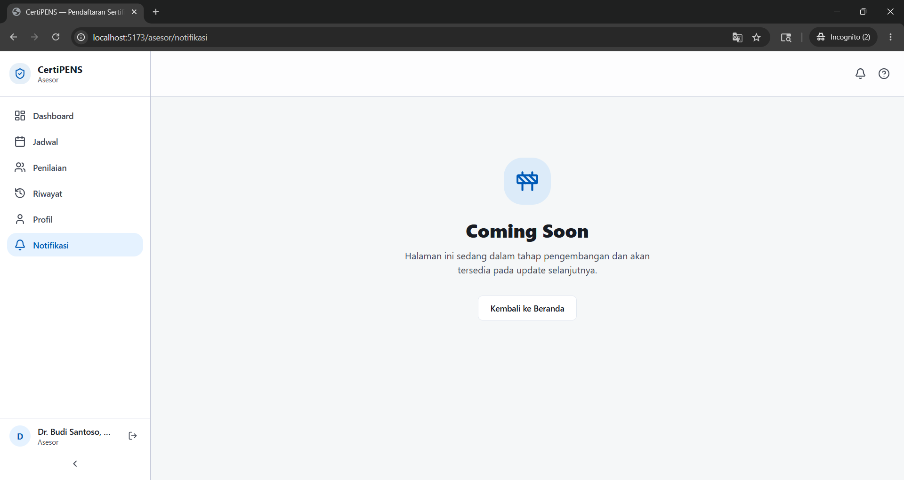
Halaman daftar pemberitahuan atau notifikasi masuk untuk asesor.

## 5. Asesi

### 01 Dashboard
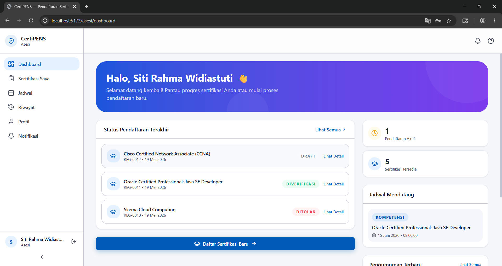
Tampilan dashboard untuk asesi yang berisi informasi umum dan status sertifikasi.

### 02 Sertifikasi Saya

Halaman yang menampilkan daftar sertifikasi yang diikuti atau didaftar oleh asesi.

### 03 Jadwal
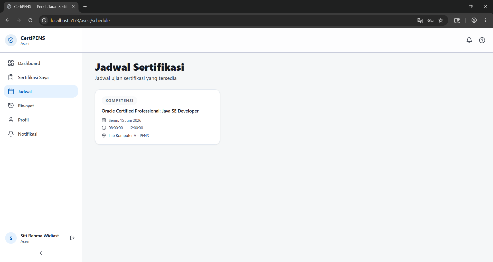
Halaman informasi jadwal asesmen atau ujian sertifikasi bagi asesi.

### 04 Notifikasi
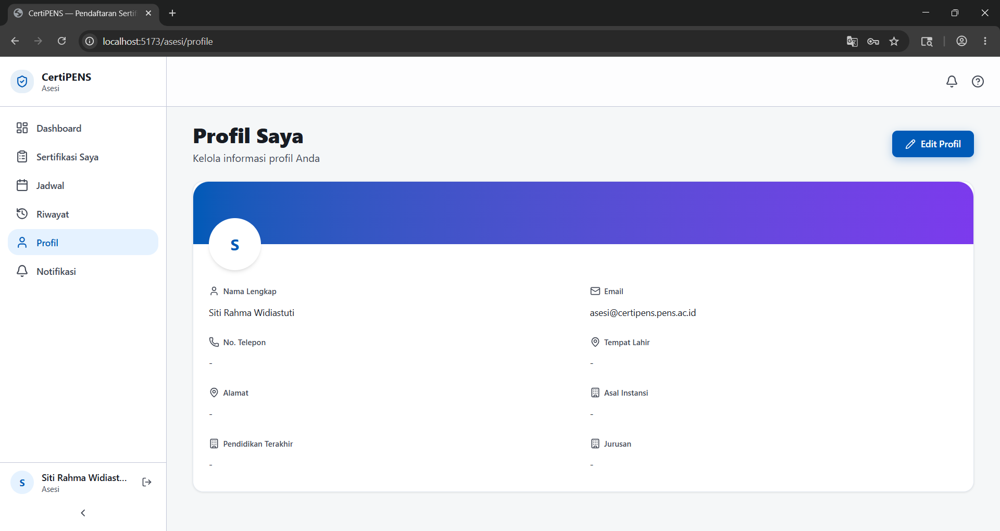
Halaman pemberitahuan dan informasi terbaru bagi asesi.

### 04 Riwayat
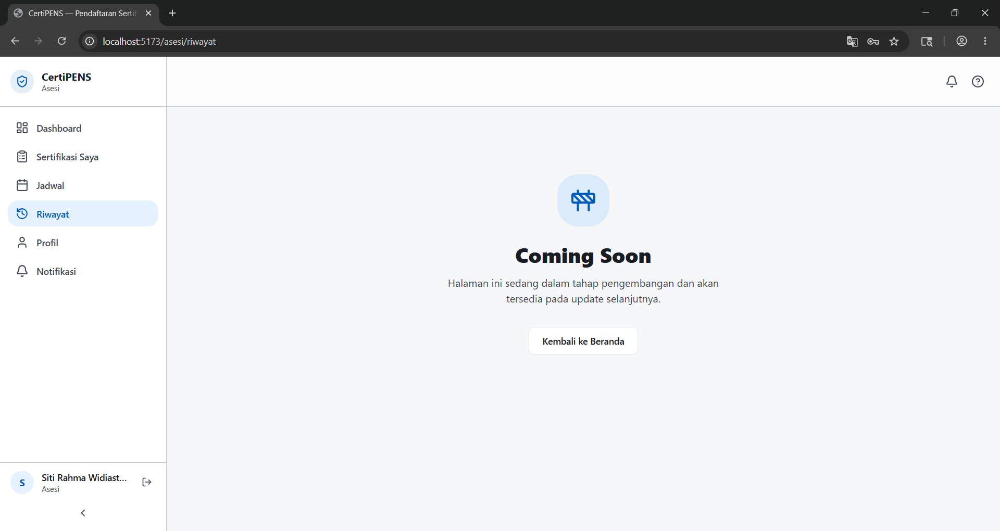
Halaman riwayat partisipasi sertifikasi yang sudah pernah diikuti.

### 05 Notifikasi
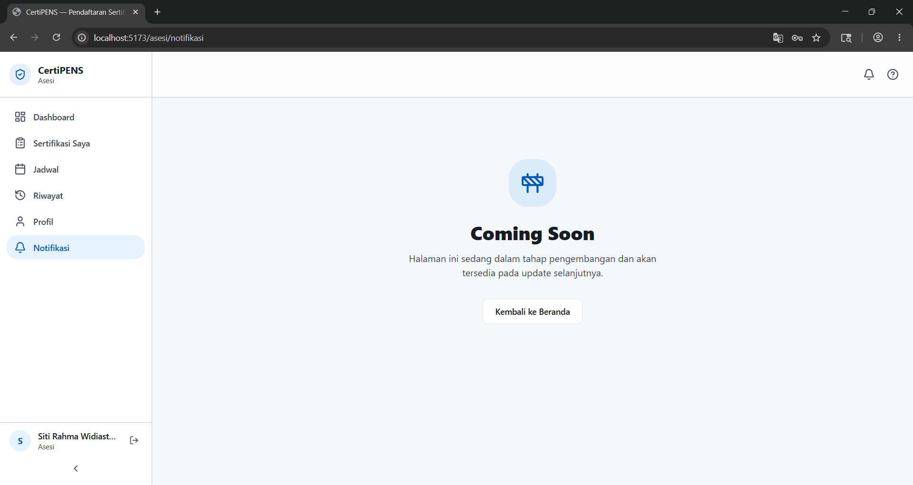
Halaman detail notifikasi sistem untuk asesi.
